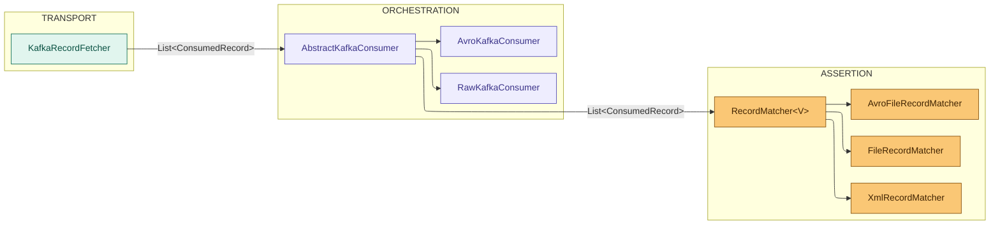
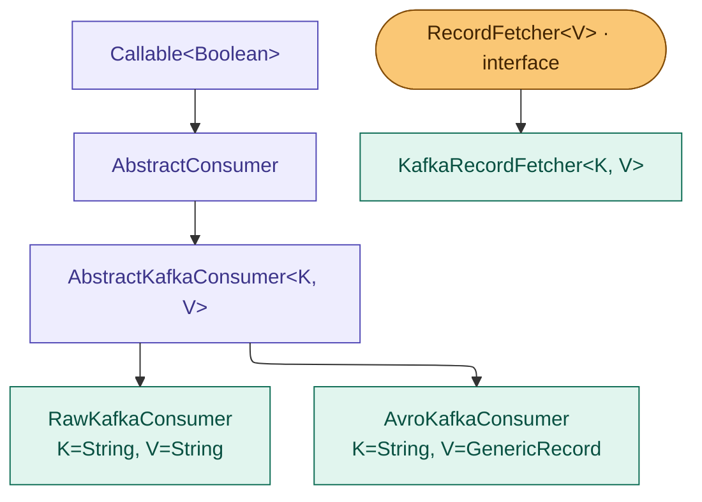

# Architecture

KTestify is built on a strict **three-layer separation of concerns**. Each layer has one job and knows nothing about the other layers' implementation details.



**`ConsumedRecord<V>` is the only data type that crosses layer boundaries.**

---

## Layer responsibilities

### Transport — `RecordFetcher<V>`

Knows: Kafka broker, partitions, offsets, deduplication.
Does NOT know: matchers, files, test frameworks.

The contract is a single interface:

```java
public interface RecordFetcher<V> extends AutoCloseable {
    List<ConsumedRecord<V>> fetch() throws FetchException;
    void close();
}
```

Swapping Kafka for IBM MQ means writing a new `IbmMqRecordFetcher<V>` — nothing else changes.

---

### Orchestration — `AbstractKafkaConsumer`

Knows: fetch → match → result wiring.
Does NOT know: Kafka internals, comparison algorithms.

```java
// AbstractKafkaConsumer.call() — simplified
var fetcher = new KafkaRecordFetcher(context);
try {
    List<ConsumedRecord<V>> records = fetcher.fetch();      // transport
    MatchContext matchCtx = buildMatchContext();
    MatchResult result = matcher.match(records, matchCtx);  // assertion
    return result.isPassed();
} catch (FetchException e) {
    throw new ConsumerException(e.getMessage(), e);
} finally {
    fetcher.close();
}
```

---

### Assertion — `RecordMatcher<V>`

Knows: `ConsumedRecord`, expected values, comparison algorithm.
Does NOT know: Kafka, IBM MQ, any transport.

```java
@FunctionalInterface
public interface RecordMatcher<V> {
    MatchResult match(List<ConsumedRecord<V>> records, MatchContext context);
}
```

---

## Module boundaries

```
ktestify-core                      ktestify-cucumber
───────────────────────────────    ──────────────────────────────────
RecordFetcher<V>                   BackgroundStepDefinition
KafkaRecordFetcher              ◄──────── ConsumerContext (config only)
AbstractKafkaConsumer              ValidationStepDefinition
RecordMatcher<V>                   ConsumerValidationService
MatchContext / MatchResult
ConsumedRecord<V>
```

**`ktestify-cucumber` must never import `org.apache.kafka.*`**.
It uses `ConsumerContext` / `ProducerContext` (ktestify-core abstractions) to configure the engine and receives only `ConsumedRecord<V>` back.

---

## Class hierarchy


### Matchers hierarchy

```
RecordMatcher<V>  (@FunctionalInterface)
├── NoOpRecordMatcher<V>
├── FileRecordMatcher
├── XmlRecordMatcher
├── XPathRecordMatcher
├── FieldsRecordMatcher
├── FileKeyRecordMatcher
├── KeyRecordMatcher
├── AvroFileRecordMatcher
├── AvroFileKeyRecordMatcher
├── AvroFieldsRecordMatcher
└── AvroKeyRecordMatcher
```
---

## See also

- [Core concepts →](core-concepts)
- [Transports — Kafka →](transports/kafka)
- [Adding a transport →](transports/adding-a-transport)
- [Built-in matchers →](matchers/built-in-matchers)

