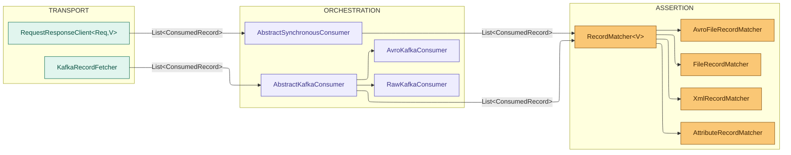
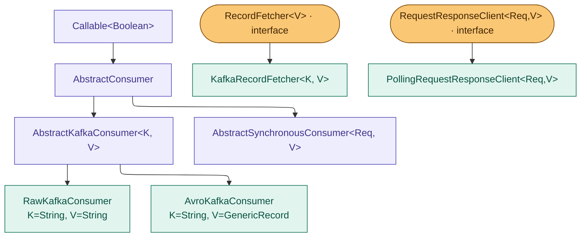

# Architecture

KTestify is built on a strict **three-layer separation of concerns**. Each layer has one job and knows nothing about the other layers' implementation details.

Since version `1.1.1`, the transport layer has **two sibling contracts** instead of one. `RecordFetcher<V>` models a background stream you poll until a record appears (Kafka, Azure Blob). `RequestResponseClient<Req, V>` models a synchronous, caller-initiated call where you send a request right now and get an answer immediately (HTTP, gRPC, SOAP). Both return `List<ConsumedRecord<V>>`, so the orchestration and assertion layers below stay identical no matter which contract a given transport implements.



**`ConsumedRecord<V>` is the only data type that crosses layer boundaries.**

Synchronous transports additionally populate a new `attributes` map on `ConsumedRecord` (an HTTP status code, a future gRPC status code, an MQ reason code) for metadata that is not a protocol header. Asynchronous transports leave it empty. See [Core Concepts →](core-concepts) for the full field list.

---

## Layer responsibilities

### Transport - `RecordFetcher<V>`

Knows: Kafka broker, partitions, offsets, deduplication.
Does NOT know: matchers, files, test frameworks.

The contract is a single interface:

```java
public interface RecordFetcher<V> extends AutoCloseable {
    List<ConsumedRecord<V>> fetch() throws FetchException;
    void close();
}
```

Swapping Kafka for IBM MQ means writing a new `IbmMqRecordFetcher<V>`, nothing else changes.

---

### Transport, synchronous - `RequestResponseClient<Req, V>`

Knows: how to send one request and turn the answer into `ConsumedRecord`.
Does NOT know: matchers, files, test frameworks, and does not block waiting for something to "appear".

```java
public interface RequestResponseClient<Req, V> extends AutoCloseable {
    List<ConsumedRecord<V>> execute(Req request) throws FetchException;
    void close();
}
```

This is the contract an HTTP client plugin implements. See [Synchronous Transports →](transports/synchronous-transports) for the full guide.

---

### Orchestration - `AbstractKafkaConsumer`

Knows: fetch → match → result wiring.
Does NOT know: Kafka internals, comparison algorithms.

```java
// AbstractKafkaConsumer.call(), simplified
var fetcher = new KafkaRecordFetcher(context);
try {
    List<ConsumedRecord<V>> records = fetcher.fetch();      // transport
    MatchContext matchCtx = buildMatchContext();
    MatchResult result = matcher.match(records, matchCtx);  // assertion
    return result.isPassed();
} catch (FetchException e) {
    throw new ConsumerException(e.getMessage(), e);
} finally {
    fetcher.close();
}
```

---

### Orchestration, synchronous - `AbstractSynchronousConsumer<Req, V>`

Knows: buildRequest → execute → match → result wiring, for transports where the caller supplies the request explicitly instead of the fetcher blocking on a subscription.
Does NOT know: HTTP, gRPC, or any transport internals.

```java
// AbstractSynchronousConsumer.call(), simplified
try {
    Req request = buildRequest();
    List<ConsumedRecord<V>> records = client.execute(request);   // transport
    MatchResult result = matcher.match(records, buildMatchContext()); // assertion
    return result.isPassed();
} catch (FetchException e) {
    throw new ConsumerException(e.getMessage());
}
```

Unlike `AbstractKafkaConsumer`, the client is not closed in a `finally` block here. A `RequestResponseClient` is expected to be a longer lived, connection pooled client (like `java.net.http.HttpClient`), owned and closed by the plugin's shared scenario resources, not created and discarded per call.

---

### Assertion - `RecordMatcher<V>`

Knows: `ConsumedRecord`, expected values, comparison algorithm.
Does NOT know: Kafka, IBM MQ, any transport.

```java
@FunctionalInterface
public interface RecordMatcher<V> {
    MatchResult match(List<ConsumedRecord<V>> records, MatchContext context);
}
```

---

## Module boundaries

```
ktestify-core                      ktestify-cucumber
───────────────────────────────    ──────────────────────────────────
RecordFetcher<V>                   BackgroundStepDefinition
RequestResponseClient<Req,V>        ValidationStepDefinition
KafkaRecordFetcher              ◄──────── ConsumerContext (config only)
AbstractKafkaConsumer              ConsumerValidationService
AbstractSynchronousConsumer
PollingRequestResponseClient
RecordMatcher<V>
MatchContext / MatchResult
ConsumedRecord<V>
```

**`ktestify-cucumber` must never import `org.apache.kafka.*`**.
It uses `ConsumerContext` / `ProducerContext` (ktestify-core abstractions) to configure the engine and receives only `ConsumedRecord<V>` back.

---

## Class hierarchy


### Matchers hierarchy

```
RecordMatcher<V>  (@FunctionalInterface)
├── NoOpRecordMatcher<V>
├── FileRecordMatcher
├── XmlRecordMatcher
├── XPathRecordMatcher
├── FieldsRecordMatcher
├── FileKeyRecordMatcher
├── KeyRecordMatcher
├── AttributeRecordMatcher<V>
├── AvroFileRecordMatcher
├── AvroFileKeyRecordMatcher
├── AvroFieldsRecordMatcher
└── AvroKeyRecordMatcher
```
---

## See also

- [Core concepts →](core-concepts)
- [Transports, Kafka →](transports/kafka)
- [Adding a transport →](transports/adding-a-transport)
- [Synchronous transports →](transports/synchronous-transports)
- [Built-in matchers →](matchers/built-in-matchers)

