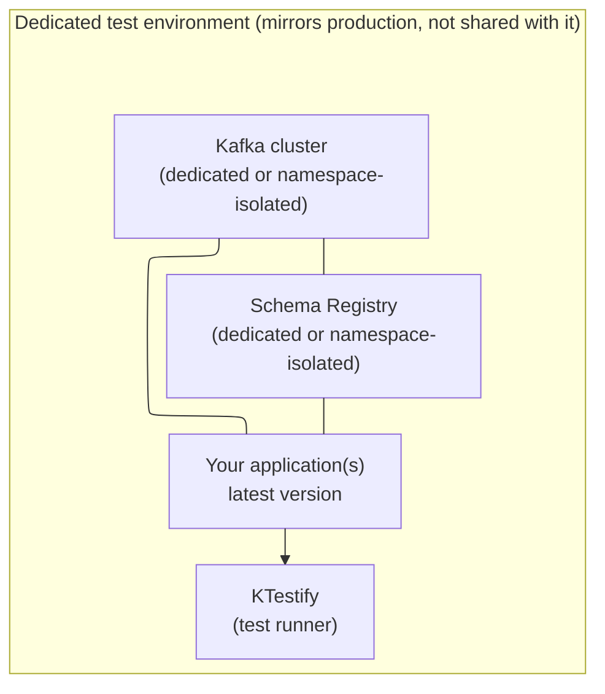

# CI Environment : Test Against a Production Mirror

## The purpose of KTestify

KTestify exists to **catch regressions** in your event-driven system before they reach production.

The idea is straightforward: you maintain a dedicated environment that mirrors production as closely as possible, the same Kafka topics, the same Schema Registry subjects, the same microservices or monolith, but with the **latest version of your code** deployed to it. KTestify runs against that environment, produces messages to input topics, and asserts that output topics contain the expected results.

If a change breaks the contract between two services, a renamed field, a schema evolution, a missed edge case, KTestify catches it here, not in production.

> **Run it on a daily schedule.** The most effective way to use KTestify is as a recurring regression gate: every night, deploy your latest code to the test environment and run the full suite. Wake up to a green build or a clear failure report.

---

## The dedicated environment rule

:::danger[Never test against a shared or production cluster]
KTestify is both a **producer and a consumer**. It writes messages to input topics and reads messages from output topics. Running it alongside real traffic causes data races, false positives.
:::

Your test environment must be **fully isolated**:



Key properties of this environment:
- **Same topology as production** : same topic names, same number of partitions, same schema subjects.
- **Latest code** : your application is deployed here first, before any release to production.
- **KTestify is the only external consumer** on output topics.
- **No other team, no other application** writes to the same topics during the test run.

---

## Why isolation is non-negotiable

### Message ownership
KTestify's deduplication registry prevents two steps within the same run from claiming the same record. It has **no protection against external producers**. If another application is concurrently writing to `orders-out`, KTestify may pick up that external record and pass it through your assertion, producing a false positive or a confusing failure.

### Offset drift
KTestify seeks to `now − consumerDeltaTime` before consuming. If another application has been producing to the topic for hours, those records fall inside the delta window. Your test may pick up a stale record that accidentally matches your expected file.

### Schema Registry ownership
Your Avro schema subjects must be stable during a run. A breaking schema evolution deployed mid-run causes serialisation failures that are hard to diagnose if you share a Schema Registry with other teams.

---

## Scheduling the daily regression run

The recommended pattern is a **nightly scheduled pipeline** that:
1. Cleans topic and statestores of previous run.
2. Runs KTestify against it.
3. Notifies the team on failure.

```
00:00  ──► Clean test environment (topics, statestores)
00:05  ──► Run KTestify suite
09:00  ──► ✅ Green : ready to release OR ❌ Red : regression found, notify team
```

This gives you a **daily regression gate**: any breaking change merged yesterday is caught overnight, before it reaches production.

import Tabs from '@theme/Tabs';
import TabItem from '@theme/TabItem';

<Tabs>
  <TabItem value="gitlab" label="GitLab CI scheduled pipeline">

```yaml title=".gitlab-ci.yml"
regression-tests:
  stage: test
  image: docker:27
  services:
    - docker:27-dind
  rules:
    - if: '$CI_PIPELINE_SOURCE == "schedule"'
  script:
    - docker run --rm
        -v "$CI_PROJECT_DIR/workspace/features:/workspace/features"
        -v "$CI_PROJECT_DIR/workspace/reports:/workspace/reports"
        -e KTESTIFY_BOOTSTRAP_SERVERS="$TEST_KAFKA_BROKERS"
        -e KTESTIFY_TOPIC_NAMESPACE="$KTESTIFY_TOPIC_NAMESPACE"
        ghcr.io/ktestify/ktestify-cucumber:latest
        /workspace/features
  artifacts:
    when: always
    paths:
      - workspace/reports/
```

Create a schedule in **CI/CD → Schedules** pointing at `main`, set to run nightly.

  </TabItem>
  <TabItem value="github" label="GitHub Actions cron">

```yaml title=".github/workflows/regression.yml"
name: Nightly Regression

on:
  schedule:
    - cron: "0 0 * * *"   # midnight UTC

jobs:
  regression:
    runs-on: ubuntu-latest
    steps:
      - uses: actions/checkout@v4
      - name: Run KTestify
        run: |
          docker run --rm \
            -v "${{ github.workspace }}/workspace/features:/workspace/features" \
            -v "${{ github.workspace }}/workspace/reports:/workspace/reports" \
            -e KTESTIFY_BOOTSTRAP_SERVERS="${{ secrets.TEST_KAFKA_BROKERS }}" \
            -e KTESTIFY_TOPIC_NAMESPACE=myapp \
            ghcr.io/ktestify/ktestify-cucumber:latest \
            /workspace/features
```

  </TabItem>
</Tabs>

---

## Topic namespace isolation

If you cannot provision a fully dedicated Kafka cluster, use a unique **topic namespace** to prevent collisions. KTestify prepends the namespace to every topic name it touches:

```hocon
ktestify.kafka.topic-namespace = "myapp-ci"
# physical topic: myapp-ci.orders-in, myapp-ci.orders-out
```

Or pass it at runtime:

```bash
-e KTESTIFY_TOPIC_NAMESPACE=myapp-ci
```

Your application-under-test must be configured with the **same namespace** during the test run.

---

## Pre-run checklist

Before starting a run, ensure:

- [ ] The test Kafka cluster is **dedicated**, no other team shares it
- [ ] Your application is **deployed and healthy** in the test environment
- [ ] All required topics are **pre-created**
- [ ] Avro schema subjects are **registered** before any Avro tests run
- [ ] No other application is producing to or consuming from the output topics during the run

---

## See also

- [Installation →](installation), pulling the Docker image and CI pipeline examples
- [Configuration →](../write-tests/configuration), `topic-namespace` and all environment variable overrides
- [Timeout tuning →](../write-tests/advanced/timeout-tuning), adjust timeouts for slower environments
