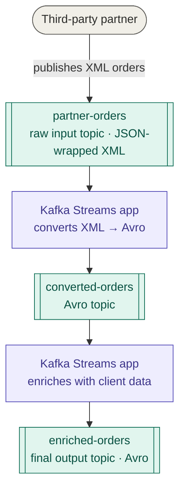

# Writing Tests with KTestify

KTestify tests are **Gherkin feature files**. If you've written BDD tests before, the format will feel familiar. If not, don't worry, it reads almost like plain English.

A feature file has two building blocks:

---
## The Background

The `Background` runs **once before every scenario** in the file. This is where you declare everything your tests will need: which topics exist, what namespace they live in, where your asset files are.

Think of it as *setting the stage* before the play begins.

```gherkin
Background:
  Given namespace
    | namespace |
    | orders    |
  Given input topic
    | topicName        | topicAlias    |
    | partner-orders   | partner-in    |
  Given output topic
    | topicName        | topicAlias    |
    | enriched-orders  | enriched-out  |
  Given assets directory
    | absolutePath                                              |
    | /workspace/features/order-from-partner/assets            |
```

You declare this **once per feature file**. Every scenario that follows shares the same topics and assets directory.

---

## The Scenarios

Each `Scenario` describes one test flow. It has two parts:

- **`When`**, the action: send a message, trigger something, wait.
- **`Then`**, the assertion: what record do you expect to appear on the output topic?

```gherkin
Scenario: Partner order is converted and enriched
  When record from file is sent
    | topicName      | file             | recordKey  |
    | partner-orders | order-xml.json   | order-001  |
  Then expected record from file based on schema
    | topicAlias    | file                  | excludedKeys |
    | enriched-out  | order-enriched.json   | timestamp    |
```

That's it. KTestify handles everything in between, producing the message, waiting for the output topic to respond, fetching the record, and comparing it against your expected file.

---

## A real example, Order from partner

Let's say you have this system:



Your feature file tests the **full chain** in one place:

```gherkin
Feature: Order from partner

  Background:
    Given namespace
      | namespace |
      | orders    |
    Given input topic
      | topicName      | topicAlias  |
      | partner-orders | partner-in  |
    Given output topic
      | topicName       | topicAlias    |
      | orders_avro     | orders-out    |
      | enriched-orders | enriched-out  |
    Given schema
      | schemaName    | schemaAlias   |
      | EnrichedOrder | enriched-order|
    Given assets directory
      | absolutePath                                         |
      | /workspace/features/order-from-partner/assets        |

  Scenario: A standard partner order is enriched with client data
    When record from file is sent
      | topicName      | file           | recordKey |
      | partner-orders | order.xml     | ORD-001   |
    Then expected record from file based on schema
      | topicAlias   | file                | excludedKeys       |
      | orders-out   | order-avro.json     | timestamp,clientId |
    Then expected record from file based on schema
      | topicAlias   | file                | excludedKeys       |
      | enriched-out | order-enriched.json | timestamp,clientId |

  Scenario: An order with an unknown partner is rejected
    When record from file is sent
      | topicName      | file                    | recordKey |
      | partner-orders | order-unknown-partner.xml | ORD-002   |
    And record should not appear in topic
      | topicAlias   | topicType | consumerReadTimeout |
      | enriched-out | avro      | 10                  |
```

Notice:
- The **Background** declares topics and the schema once, both scenarios reuse them.
- **Scenario 1** sends a valid order and asserts the enriched output.
- **Scenario 2** sends a bad order and asserts that *nothing* reaches the output topic.
- File paths (`order.json`, `order-enriched.json`) are relative to the `assets` directory.

---

## Your assets folder

Right next to your feature file, create an `assets/` folder with the files your scenarios reference:

```
order-from-partner/
├── order-from-partner.feature
└── assets/
    ├── order.json                   ← payload sent to the input topic
    ├── order-unknown-partner.json   ← payload for the rejection scenario
    └── order-enriched.json          ← expected output for assertion
```

---

## Next steps

-  [Background steps →](background/namespaces), all `Given` steps explained
-  [Action steps →](actions/send-raw-record), `When` steps: sending raw and Avro records
-  [Assertion steps →](assertions/raw-matchers), `Then` steps: every matcher type
-  [Full step reference →](step-reference), complete DataTable column reference